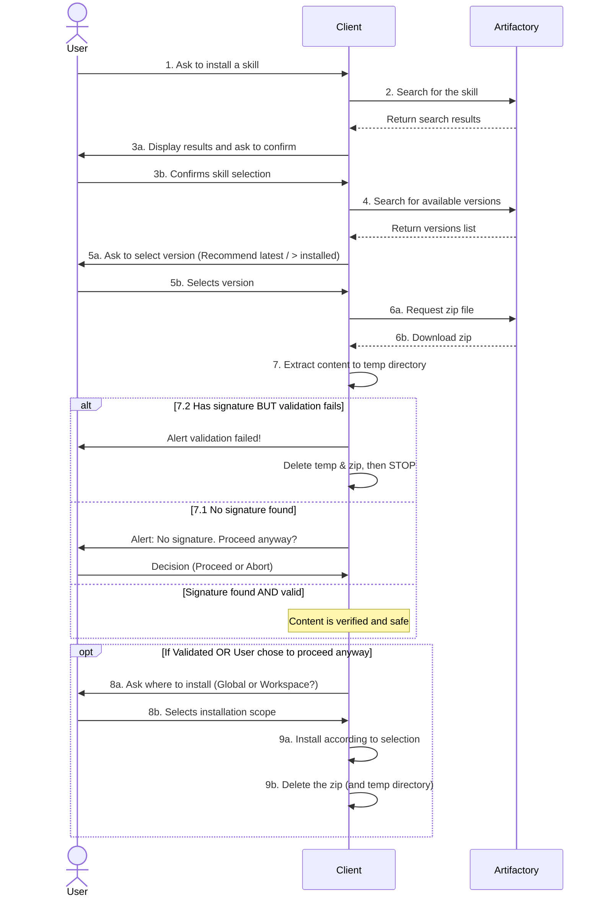

```mermaid
sequenceDiagram
    actor User
    participant Client
    participant Artifactory

    User->>Client: 1. Ask to install a skill
    Client->>Artifactory: 2. Search for the skill
    Artifactory-->>Client: Return search results
    
    Client->>User: 3a. Display results and ask to confirm
    User->>Client: 3b. Confirms skill selection
    
    Client->>Artifactory: 4. Search for available versions
    Artifactory-->>Client: Return versions list
    
    Client->>User: 5a. Ask to select version (Recommend latest / > installed)
    User->>Client: 5b. Selects version
    
    Client->>Artifactory: 6a. Request zip file
    Artifactory-->>Client: 6b. Download zip
    
    Client->>Client: 7. Extract content to temp directory
    
    alt 7.2 Has signature BUT validation fails
        Client->>User: Alert validation failed!
        Client->>Client: Delete temp & zip, then STOP
    else 7.1 No signature found
        Client->>User: Alert: No signature. Proceed anyway?
        User->>Client: Decision (Proceed or Abort)
    else Signature found AND valid
        Note over Client: Content is verified and safe
    end

    opt If Validated OR User chose to proceed anyway
        Client->>User: 8a. Ask where to install (Global or Workspace?)
        User->>Client: 8b. Selects installation scope
        Client->>Client: 9a. Install according to selection
        Client->>Client: 9b. Delete the zip (and temp directory)
    end
```