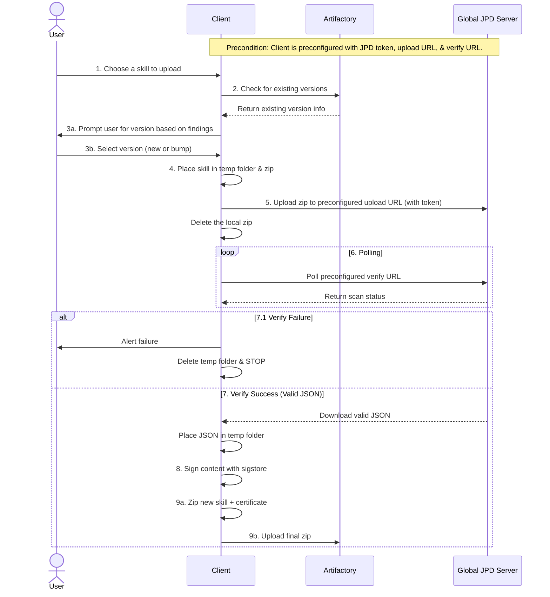

```mermaid
sequenceDiagram
    actor User
    participant Client
    participant Artifactory
    participant JPD as Global JPD Server

    Note over Client,JPD: Precondition: Client is preconfigured with JPD token, upload URL, & verify URL.

    User->>Client: 1. Choose a skill to upload
    Client->>Artifactory: 2. Check for existing versions
    Artifactory-->>Client: Return existing version info
    
    Client->>User: 3a. Prompt user for version based on findings
    User->>Client: 3b. Select version (new or bump)
    
    Client->>Client: 4. Place skill in temp folder & zip
    
    Client->>JPD: 5. Upload zip to preconfigured upload URL (with token)
    Client->>Client: Delete the local zip
    
    loop 6. Polling
        Client->>JPD: Poll preconfigured verify URL
        JPD-->>Client: Return scan status
    end

    alt 7.1 Verify Failure
        Client->>User: Alert failure
        Client->>Client: Delete temp folder & STOP
    else 7. Verify Success (Valid JSON)
        JPD-->>Client: Download valid JSON
        Client->>Client: Place JSON in temp folder
        Client->>Client: 8. Sign content with sigstore
        Client->>Client: 9a. Zip new skill + certificate
        Client->>Artifactory: 9b. Upload final zip
    end
```